---
puppeteer:
  format: A4
  preferCSSPageSize: true
  timeout: 3000
---

# Project Horizon｜游戏用户增长与留存分析

## 1. 项目概览

Project Horizon 是虚构的跨平台免费动作角色扮演游戏。全部 20,000 位用户及 180 天行为均为合成数据，用于展示分析方法；没有真实玩家数据、企业项目经历或真实商业提升。

项目从留存和主线漏斗出发，用注册后前八日行为预测后续沉默，并据此安排三个随机实验方案。本次数据由 Wolfram 生成，PostgreSQL 是唯一事实源；本次分析器为 Wolfram。认证范围为 wolfram_only，运行 ID 为 73396c14-043b-45fb-9072-b81bbbe5666d。下文数字来自本次配置，种子为 20261005。

## 2. 最值得先试的三个问题

| 优先问题 | 看到的结果 | 下一步 |
|---|---|---|
| 优先实验第12级首领战 | 核心循环→第二章损失 27.52%，第二章→第三章损失 27.96%；第12级失败率 63.10% | 首次尝试时比较难度、资源或引导调整 |
| 验证 Android 性能优化 | Android 第7日留存最低，比 PC 低 3.44 个百分点 | 按市场和版本分层，随机比较优化效果 |
| 优先触达高风险用户 | 最高风险10%流失集中度 1.49×，覆盖 14.86% 的流失用户 | 留出随机对照；回流用户另做导航实验 |

这些结果用来决定下一步先试什么，相关改动尚未测得收益。

## 3. 本次独立分析与数据血缘

实际生成 242,110 次会话、395,444 条行为事件和 930 笔交易。七张关系表连接用户、获客、会话、进度、行为、交易与内容触达；CSV 只作传输及审计产物。

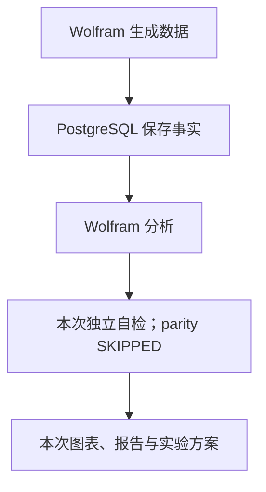

本次 pytest 通过 104 项、跳过 27 项。Python Notebook：SKIPPED；Wolfram 自检与原生 Notebook：已执行。当次跨语言 parity 为 SKIPPED；本次未执行双引擎交叉验证。主外键、日期、会话序号、时长、缺失与进度单调性均纳入质量检查。

每个留存观察日分别筛选已有完整观察窗口的用户，称为成熟样本。模型用注册后第0至第7日的信息，预测第22至第30日是否沉默；标准化只拟合训练集，潜在变量和未来行为不进入特征。

## 4. 第7日留存为 16.87%，后期 DAU 以存量用户为主

| 指标 | 实际结果 | 口径 |
|---|---:|---|
| 第1日留存 | 32.34% | 第1日有活跃，成熟分母 |
| 第7日留存 | 16.87% | 第7日有活跃，成熟分母 |
| 第30日留存 | 10.87% | 第30日有活跃，成熟分母 |
| 前八日核心循环解锁 | 88.54% | 第0至第7日累计解锁 |
| 曾付费用户比例 | 3.41% | 观测期内首次付费 |
| 用户平均收入 | 0.45 美元 | 收入除以全部注册用户 |

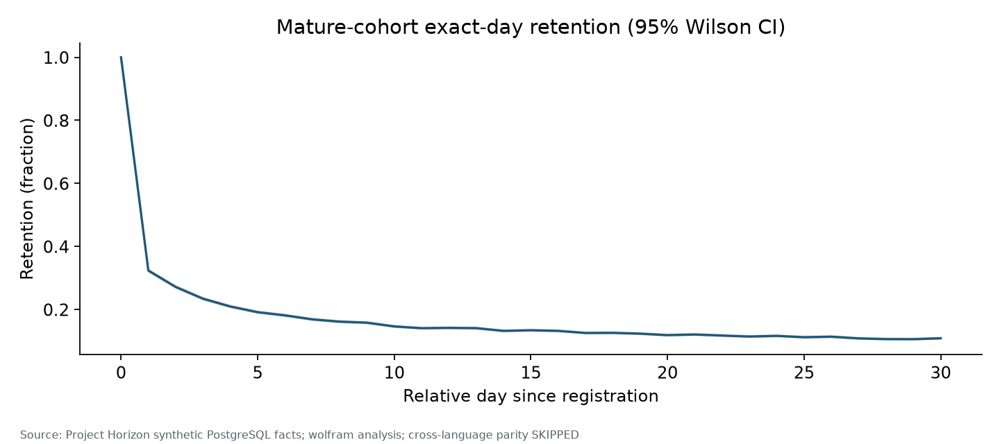

按注册周检查队列差异，各观察日使用各自的成熟分母。热图空白表示窗口尚未成熟，并非零留存。

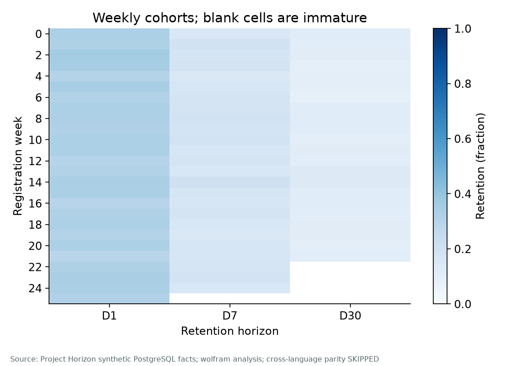

末日 DAU、WAU、MAU 为 **1,726、5,888、9,771 人**。面积图总高度等于 DAU；从下到上依次为当日新注册、距上次活跃不足七日的存量，以及间隔至少七日后的回流用户。

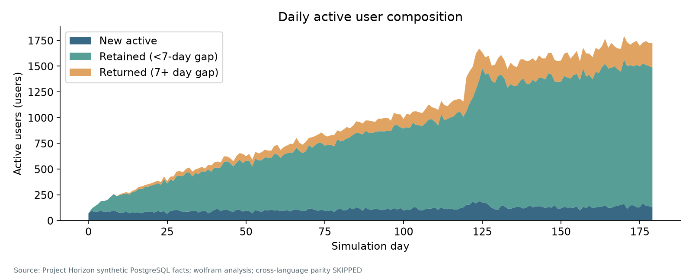

核心循环累计解锁不等于第7日当日留存。晚注册用户付费暴露期更短，曾付费比例也不等于成熟180日队列转化率。

## 5. Android 第7日留存最低，先检验性能优化

**PC 比 Android 高 3.44 个百分点。** 各设备的实际留存率如下。

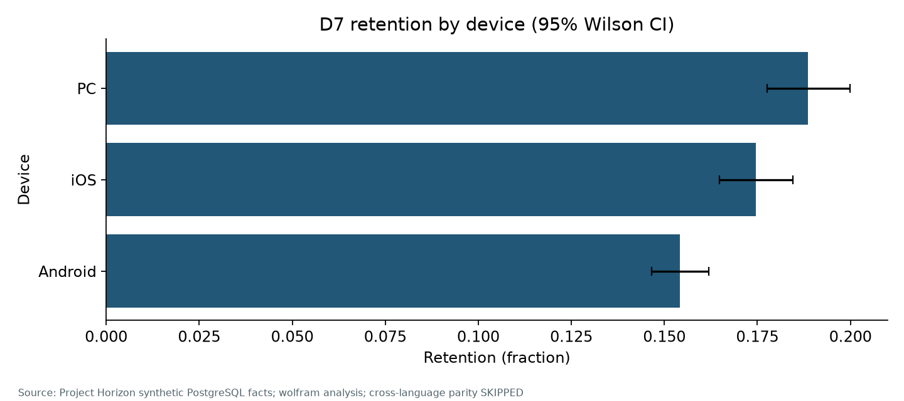

首个版本更新前后，Android 早期活跃用户日崩溃率由 7.33% 降至 4.00%，流畅度等级均值由 1.80 升至 2.08。等级是合成指标，不是每秒帧数。版本前后没有随机对照；下一步在 Android 用户中随机比较性能优化，并按市场和版本分层。

| 渠道 | 第7日留存 |
|---|---:|
| 商店推荐 | 15.66% |
| 内容创作者 | 15.90% |
| 交叉推广 | 16.44% |
| 视频广告 | 16.48% |
| 自然流量 | 18.12% |
| 好友推荐 | 19.13% |

渠道间留存差异也受到市场、设备与注册时间影响。这里没有广告成本或随机对照，无法据此推算投放回报。

## 6. 第二章前后都有明显损失，先试第12级首领战

| 核心循环→第二章损失 | 第二章→第三章损失 | 第12级尝试失败率 |
|---:|---:|---:|
| **27.52%** | **27.96%** | **63.10%** |

成熟第7日的 19,017 位用户中，16,838 人解锁核心循环，12,205 人完成第二章，8,793 人完成第三章。两个相邻步骤的损失接近；第二章→第三章转化为 72.04%。图中人数是前八日累计达到各阶段的人数，右列损失以紧邻的前一阶段为分母。

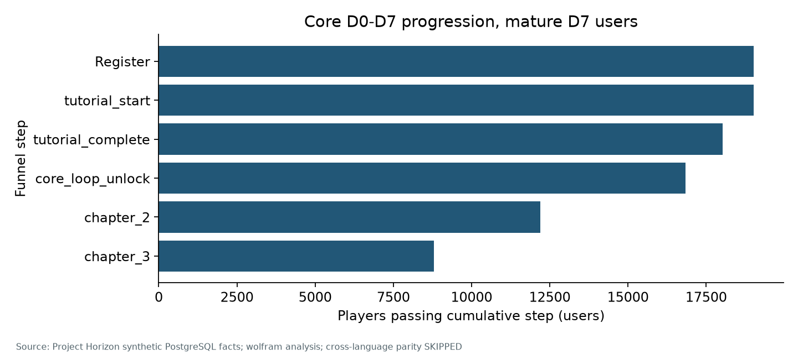

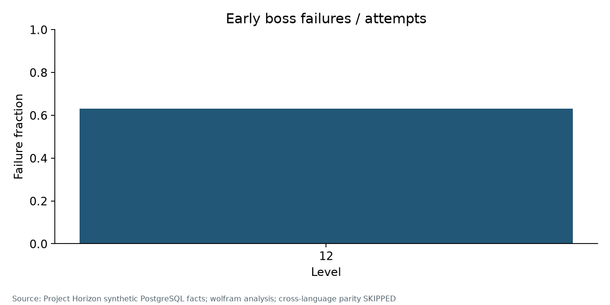

第12级的 23,831 次尝试中，15,038 次失败，失败率为 63.10%，因此先把该首领战作为实验点。可能原因包括难度、资源不足和引导不清。分母是尝试次数，同一用户可以多次尝试；现有诊断仅覆盖第12级，不能比较跨等级峰值。

活动与社交是可选功能，以第三章完成者为分母，采用率分别为 81.27% 和 42.10%，不纳入核心进度损失比较。

## 7. 只用前八日行为，预测第22–30日沉默

流失标签是注册后第22至第30日均无活跃，与“第30日当天未活跃”不同。特征为第0至第7日的参与、进度、性能和付费行为，只纳入完整观察到第30日的用户。

| 时间划分 | 注册日范围 | 用户数 |
|---|---|---:|
| 训练集 | 第0–89日 | 8,455 |
| 验证集 | 第90–119日 | 3,368 |
| 测试集 | 第120–149日 | 4,160 |

按时间切分更接近面对新队列的部署情境。测试集不调参；非线性模型按预先设定限制使用训练期最早的 8,455 位用户。

## 8. 风险排序有用，复杂模型增益有限

下表为本次 Wolfram 独立分析的时间测试结果；跨语言 parity 为 SKIPPED。

| 模型 | ROC-AUC ↑ | PR-AUC ↑ | Brier ↓ | 前10%集中度 | 前10%捕获率 |
|---|---:|---:|---:|---:|---:|
| Logistic | 0.6844 | 0.7530 | 0.2196 | 1.49× | 14.86% |
| 非线性提升树 | 0.6815 | 0.7513 | 0.2195 | 1.45× | 14.49% |

**非线性模型的 ROC-AUC 低 0.002926，实际区分能力几乎没有变化，因此保留更容易解释的 Logistic 作为排序基线。** ↑ 表示越高越好，↓ 表示越低越好；概率是否准确还要看校准。

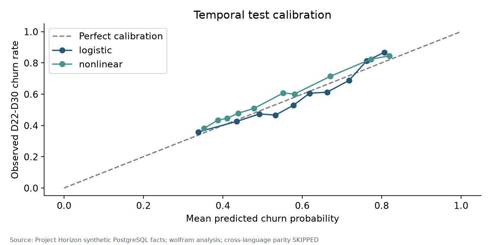

校准图沿用现有时间测试集预测，按预测概率区间分组。点越接近虚线，分组预测越接近实际比例；空区间不绘点。Brier 衡量整体概率误差，上线前仍需验证新队列校准与漂移。

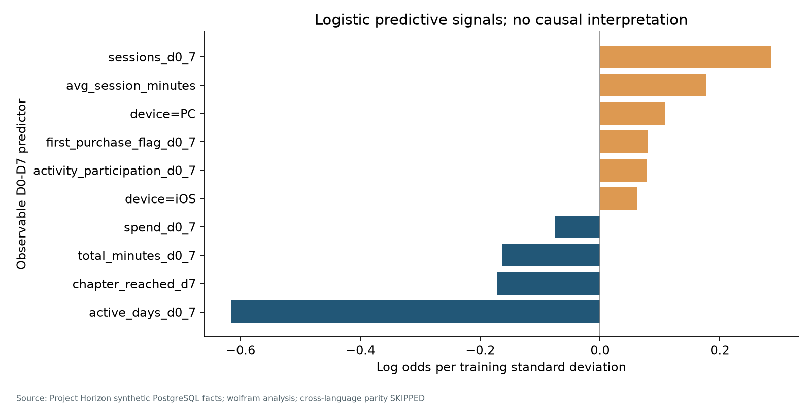

单个系数表示**控制其他特征后的条件预测关联**。会话次数与活跃天数相关系数为 0.909；57.43% 的成熟用户会话数多于活跃日数。会话、活跃天数、总时长和平均会话时长应作为一组参与度指标理解。会话次数的正系数不能解释为“多玩会导致流失”，也不能代替单变量趋势。

| 触达预算 | 最高风险组流失集中度 | 捕获目标窗口流失用户 |
|---:|---:|---:|
| **10%** | **1.49×** | **14.86%** |

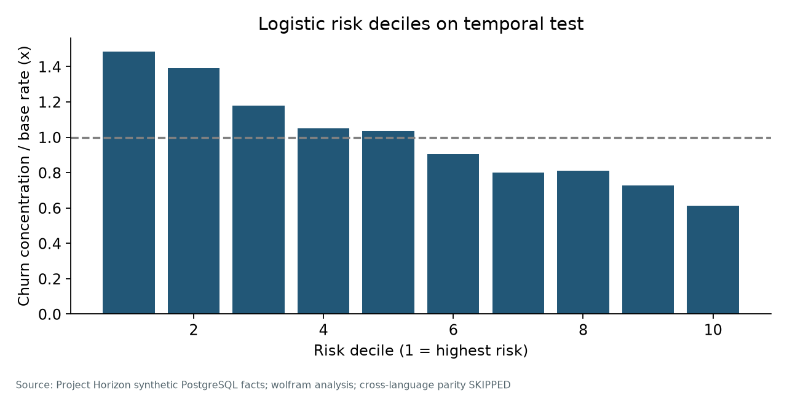

最高风险组的实际流失率为总体的 1.49 倍，说明排序有用；高风险不等于可被挽回。运营名单按预算确定。阈值0.5下精确率 64.87%、召回率 81.35%、F1 0.7218 仅作分类诊断，与图中十分位排序不同。

## 9. 分群用于安排服务顺序，回流还要看后续活跃

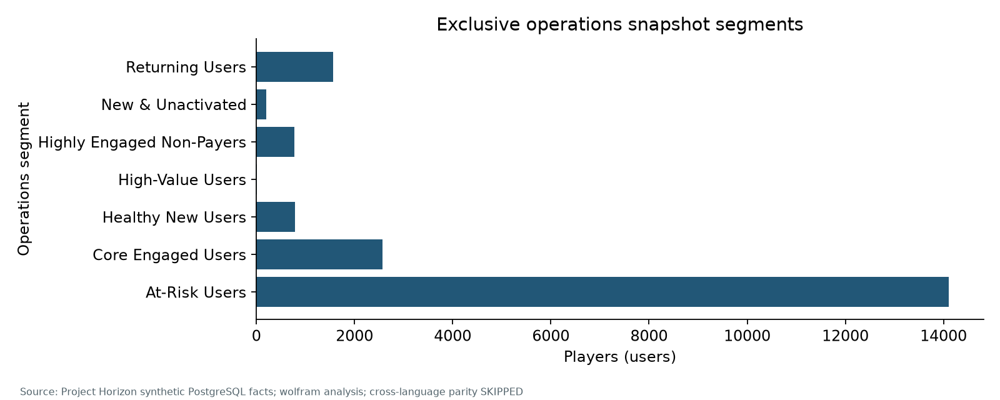

| 期末分群 | 人数（占比） | 行为特征 | 可尝试的服务 |
|---|---:|---|---|
| 近期沉默用户 | 14,109（70.55%） | 0.82 天；2.68% 曾付费 | 判断沉默原因，再检验轻量触达 |
| 核心活跃用户 | 2,567（12.83%） | 6.37 天；8.18% 曾付费 | 保持内容节奏，观察体验稳定性 |
| 回流用户 | 1,563（7.81%） | 5.48 天；5.57% 曾付费 | 检验个性化内容导航 |
| 健康新用户 | 782（3.91%） | 1.91 天；0.38% 曾付费 | 跟进进度，避免过早商业触达 |
| 高活跃未付费用户 | 774（3.87%） | 11.46 天；0.00% 曾付费 | 检验内容与付费需求匹配 |
| 新注册未激活用户 | 201（1.00%） | 1.16 天；0.00% 曾付费 | 检验引导与核心循环入口 |
| 高价值用户 | 4（0.02%） | 5.25 天；100.00% 曾付费 | 优先处理体验问题 |

行为特征中的天数是近28日平均活跃日期数，付费比例为观测期内曾付费比例。分群按固定优先级互斥。“近期沉默用户”是最近七日未活跃的规则，与第7日模型名单不同；期末分群回看留存有后验选择，只适合描述。高价值群仅4人，行动优先级不能只看群体人数。

第二次版本更新前十四日无活跃且更早注册的用户共 6,822 人，七日内 1,015 人回流，回流率 14.88%。返回后第0至第6日平均活跃 2.57 个不同日期。该观察池与上表期末“回流用户”的快照口径不同，人数无需相同。

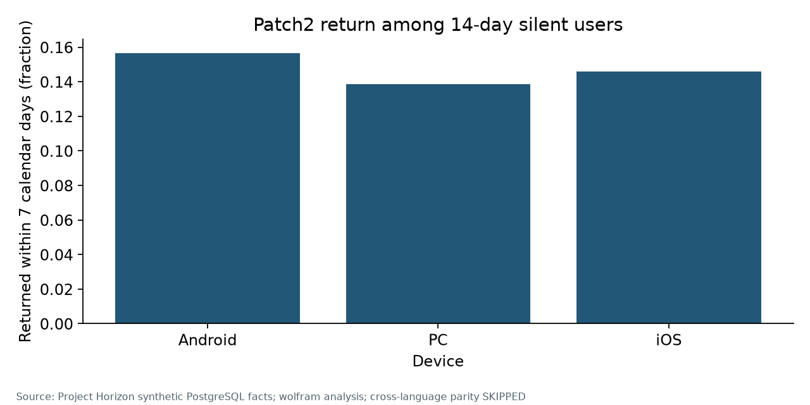

这 14.88% 的回流混合了自然回访、时间变化和版本更新的影响，不能直接归因于版本。回流导航实验在用户实际返回时随机分组。

## 10. 三项方案都在实际触发时随机分组

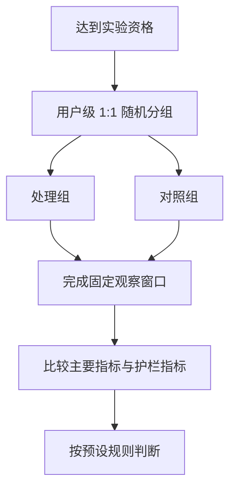

| 实验 | 主要指标及窗口 | 历史人数 | 基线 | 规划 MDE | 每组人数 |
|---|---|---:|---:|---:|---:|
| A：关卡 | 首次尝试当日至第3日，完成第三章 | 15,187 | 69.95% | +2.5 个百分点 | 5,149 |
| B：扶持 | 第30日当日留存 | 416 | 6.01% | +3.0 个百分点 | 1,200 |
| C：导航 | 返回后第0–6日活跃日期数 | 1,015 | 2.57 天 | +0.3 天 | 236 |

A 包含当日及之后三日，共四个日历日期；历史基线包含所有完整随访的首次尝试用户，不因通关筛选，其中 10,623 人在窗口内完成。表中 MDE 均为规划假设，历史资格人数不等于未来招募保证。

> **A｜第12级首领战优化**
>
> 玩家首次尝试时随机分组，一组采用关卡难度、资源或引导优化，另一组保持原体验。比较随后四个日历日期内的第三章完成率，资格不按是否通关筛选。另看注册后第7、14日成熟留存，以及崩溃、时长、付费和后续进度。

> **B｜第7日高风险用户扶持**
>
> 第7日风险最高的10%用户随机分组，处理组安排个性化任务提示与资源扶持。主要比较第30日当日留存，次要比较第22至第30日是否活跃；监控崩溃、付费和退出触达。

> **C｜实际回流时的内容导航**
>
> 连续十四日沉默的用户实际返回时随机分组，处理组使用个性化回流内容导航。主要比较返回后第0至第6日活跃日期数，并观察崩溃、再次沉默和付费。均值样本量近似上线前需模拟检验。

均按用户1:1分配、双侧显著性水平0.05、统计功效0.80规划。锁定主要指标、分层、完整随访及停止规则；先完成固定观察窗口，再按预设规则判断。**实验尚未执行，没有测得因果效应。**

## 11. 分析边界与复现说明

- 合成机制编码用户异质性、生命周期衰减、性能摩擦和关卡门槛，不能外推为真实市场事实。
- 引导、社交与内容触达有参与度自选择，相关不代表因果。
- 版本与回流比较有时间、队列混杂，缺少随机对照。
- 晚注册用户存在观察期截断；当日留存、窗口活跃、累计激活分别解读。
- 相关参与度特征限制单系数解释；模型需前瞻校准、漂移与干预响应验证。
- 多会话与经济被简化，没有广告成本、网络干扰或真实投资回报。
- 留存区间仅反映二项抽样误差，不覆盖生成机制不确定性；多维分组属探索分析。
- 样本量依赖独立用户与固定窗口假设，不构成已实现商业提升。

### 完整项目与复现资料

完整源码、数据字典、分析边界、跨语言一致性验证、实验设计及复现说明均公开在 GitHub：

**[Project Horizon 项目仓库](https://github.com/Li3Zi3han2/ProjectHorizonGrowthRetentionAnalytics)**

本作品 PDF 可独立阅读；源码、验证记录与复现材料不在求职附件中重复打包。
